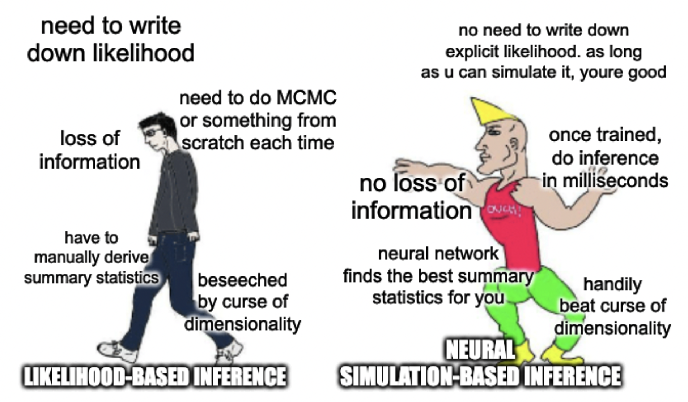

# SBI Lecture/Tutorial

A gentle introduction to some neural simulation-based inference methods. Jupyter notebook to go along with a guest lecture for the MIT course 8.16: Data Science in Physics.

## Simulation-based inference

Simulation-based inference (SBI) is a powerful class of methods for performing inference in settings where the likelihood is computationally intractable, but simulations can be realized via forward modeling. 

In this lecture we will
- Introduce the notion of an implicit likelihood, and how to leverage it to perform inference;
- Look at a "traditional" method for likelihood-free inference, Approximate Bayesian Computation (ABC);
- Build up two common modern _neural_ SBI techniques: neural likelihood-ratio estimation (NRE) and neural posterior estimation (NPE);
- Introduce the concept of statistical coverage testing and calibration.

As examples, we will look at a simple Gaussian-signal-on-power-law-background ("bump hunt"), where the likelihood is tractable, and a more complicated example of inferring a distribution of point sources, where the likelihood is computationally intractable.

